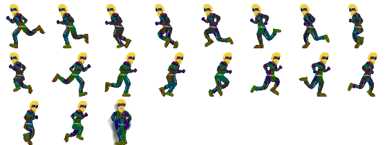

# [Unity3D] - PaskyRun
---

First "Hello World" project just to learn Unity3D basics.  

A very ugly clone of [GravityGuy](https://itunes.apple.com/it/app/gravity-guy/id398348506?mt=8) for iOS, maded in *Unity3D* using **C#**. But i learn something new! 

###Features (learned):
- Infinite vertical scrolling menu  
- Multilevel  
- Levels locked until completion  
- Levels and blocks are created runtime using CSV files  
- Audio snippet for object collision and game background
- Collectible objects (stars)
- Animated sprite
- Scrollable backgrounds
- Save/Load data from disk
- Autolayout
- Custom fonts

###How it works?
It's very simple game. Is an auto-scrolling game that pressing "Space" (on desktop) or "Touch" (mobile) on screen, the player change its gravity.  
You do not drop out of the blocks and must reach the exit door!

###Levels
Levels are created using TileMap editor for MacOS using this sprite:  

and next exported as CSV file like this:  

	-1,68,56,56,56,44,-1,-1,-1,-1,-1,-1,56,56,68,56,56,56,56,56,56,56,56,56,56,56,56,56,-1,-1,-1,-1,-1,-1,-1,56,56,56,68,56,56,56,56,56,56,56,56,56,56,56,56,-1,-1,-1,-1,-1,-1,-1,-1,-1,-1,-1,-1,-1,-1,-1,-1,-1,-1,-1,-1,-1,56,56,56,56,56,56,56,56,56,56,56,56,56,56,56,56,56,56,56,56,56,56,56,56,56,56,56,44
	-1,-1,-1,-1,-1,-1,-1,-1,-1,-1,-1,-1,-1,-1,-1,-1,-1,-1,-1,-1,-1,-1,-1,-1,-1,-1,-1,-1,-1,-1,-1,-1,-1,-1,-1,-1,-1,-1,-1,-1,-1,-1,-1,-1,-1,-1,-1,-1,-1,-1,-1,-1,-1,-1,-1,-1,-1,-1,47,35,35,35,35,35,35,35,23,-1,-1,-1,-1,-1,-1,-1,-1,-1,-1,-1,-1,-1,-1,31,-1,-1,-1,-1,-1,-1,-1,-1,-1,-1,-1,-1,-1,-1,-1,-1,-1,149
	-1,40,-1,-1,999,999,999,-1,-1,-1,60,-1,-1,-1,-1,-1,-1,-1,-1,-1,-1,-1,-1,-1,-1,-1,999,999,999,-1,-1,-1,-1,-1,60,-1,999,-1,-1,-1,-1,-1,999,32,20,152,152,152,151,8,999,-1,-1,-1,999,999,999,-1,-1,-1,-1,-1,-1,-1,-1,-1,-1,-1,-1,-1,60,-1,999,-1,-1,-1,-1,-1,-1,-1,-1,31,-1,-1,60,-1,-1,-1,-1,-1,-1,-1,-1,40,-1,999,-1,-1,81,149
	47,35,35,35,35,35,35,35,35,35,35,35,23,-1,-1,-1,-1,-1,-1,-1,-1,-1,-1,-1,-1,47,35,35,35,35,35,35,35,35,35,35,23,-1,-1,-1,-1,116,103,20,152,152,152,152,152,151,103,92,-1,35,35,35,35,35,35,35,35,35,35,35,35,35,35,35,35,35,35,35,23,-1,-1,-1,-1,-1,-1,-1,47,35,35,35,35,35,23,-1,-1,-1,-1,-1,47,35,35,35,35,35,35,23
	
where a number correspond to an image name (block tile).  

  

Are loaded in the Scene simply reading the file:

	public LevelReader (int num)
	{
		TextAsset csvfile = Resources.Load (Commons.kLevelPrefix + num) as TextAsset;

		list = new ArrayList ();

		string[] linesFromfile = csvfile.text.Split ('\n');
		for (uint i = 0; i < linesFromfile.Length; i++) {
			list.Add (linesFromfile [i]);
		}
	}

and drawed at runtime:

	GameObject block = (GameObject)Instantiate (Resources.Load (col));
	block.AddComponent<BoxCollider2D> ().isTrigger = true;
	block.transform.position = new Vector3 (colIdx - 10, (rowIdx * -1) + 5, -1);

Player instead is an animated sprite:  

####Note from developer:  
All images used in this game are founded online. Probably there is a copyrigth about it. I've used only for dev.

###Screenshots
  
  
  
  
  

###Requirements

- Unity 5+
- MonoDeveloper for C#
- TileMap editor for Mac

###Platforms:
	- iOS  
	- Android  
 	- Mac  
 	- Windows

###TODO
- Complete the game, it's only an "Hello World" in Unity.

